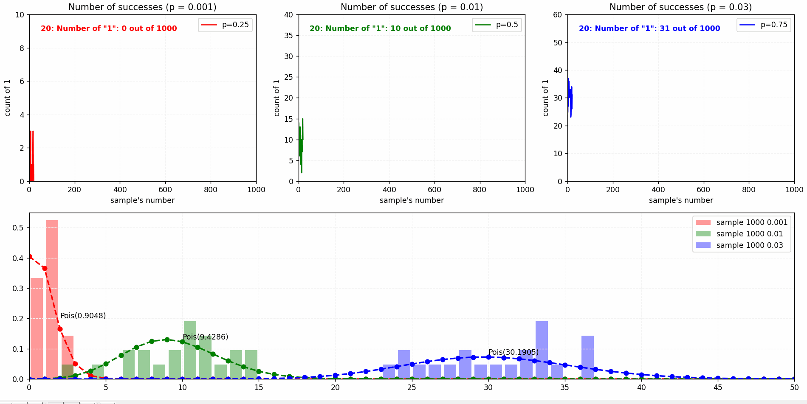
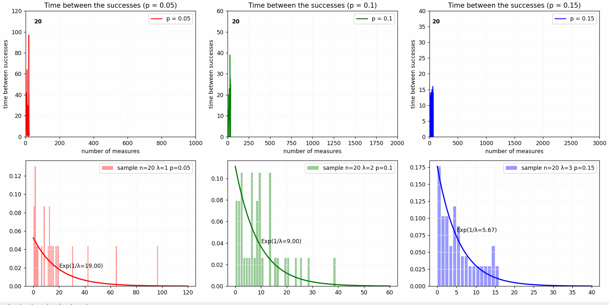
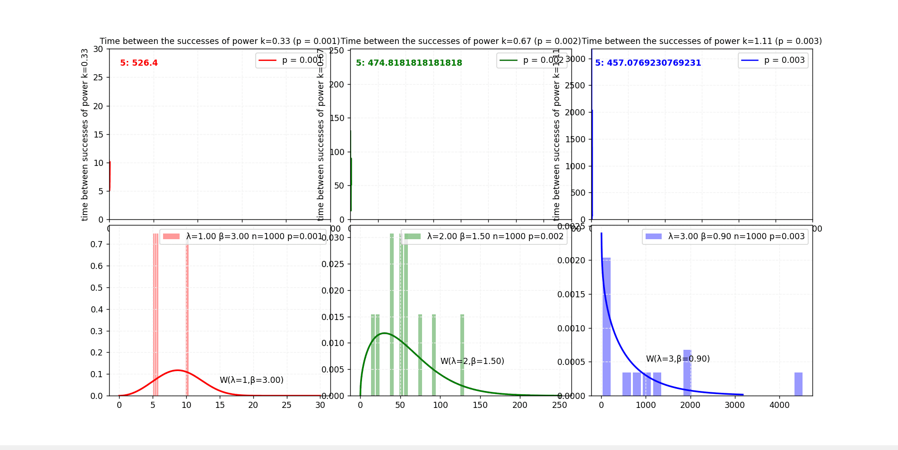
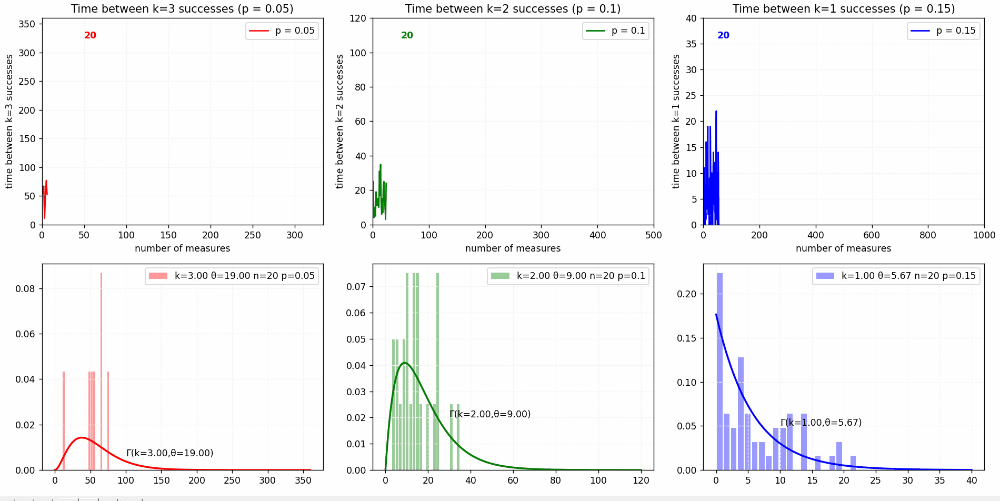
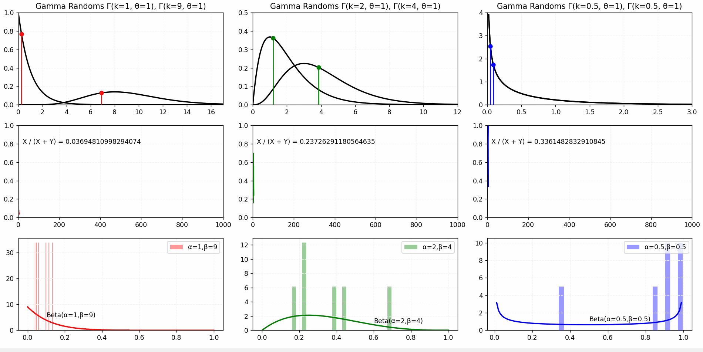
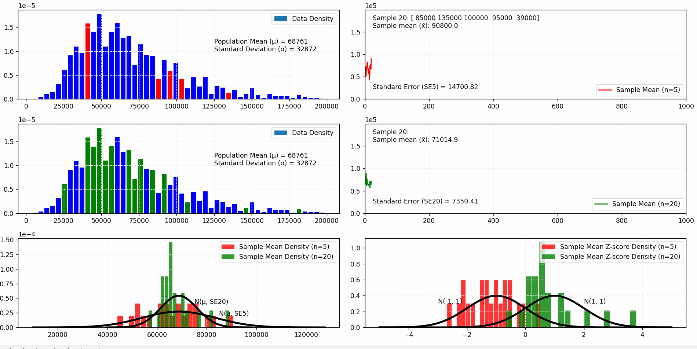
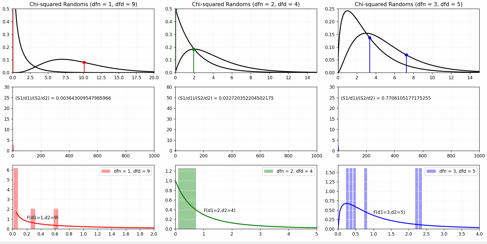

# Probability Distributions

1. [Binomial Distribution](#binomial-distribution)
2. [Poisson Distribution](#poisson-distribution)
3. [Exponential Distribution](#exponential-distribution)
4. [Weibull Distribution](#weibull-distribution)
5. [Gamma Distribution](#gamma-distribution)
6. [Beta Distribution](#beta-distribution)
7. [Hypergeometric Distribution](#hypergeometric-distribution)
8. [Normal Distribution](#normal-distribution)
9. [Student's t-Distribution](#students-t-distribution)
10. [Chi-squared Distribution](#chi-squared-distribution)
11. [F-Distribution](#f-distribution)

## Binomial Distribution

## Poisson Distribution

## Exponential Distribution

## Weibull Distribution

## Gamma Distribution

## Beta Distribution

## Hypergeometric Distribution

## Normal Distribution

## Student's t-Distribution

## Chi-squared Distribution

## F-Distribution

